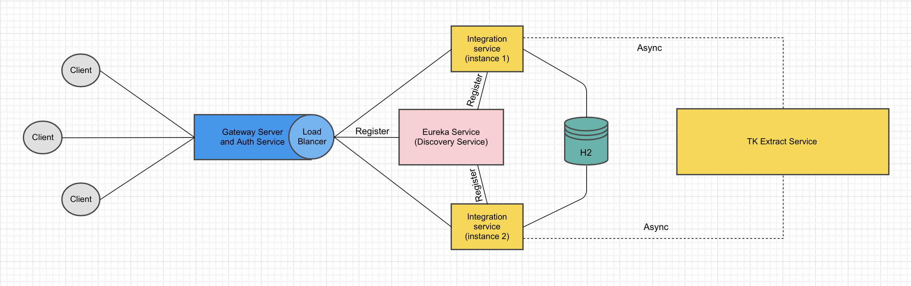
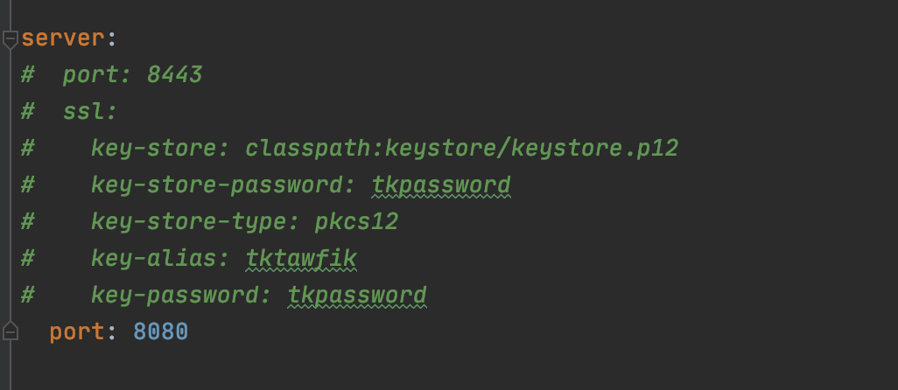

# Integration Test
 
## Intro
This is distributed architecture environment, first of all I would like to give you quick image for my architecture that I have created to finish this task you can find it blow:

The gateway here also has the end-point of authentication, I can create it in separate service that responsible for the Authentication.

The integration task separated to three subtasks 

- Bronze (Done).

- Silver (Done).

- Gold. I almost finished most of idea as you can see in my architecture, I rely on Zuul Server and Eurake Service for dynamic horizontal scaling and high availability, and I only need to you use WebFlux or RxJava for back-pressure, you can see my notes very blow.

## Build with
* Spring boot
* Maven
* java 8
  
### Prerequisites
You just need to install jdk 8 and you will be ready to go as you request in the task document.

### How to run the services 

---

I have created "/run.sh" file for each service to build and run the service, you can use it.

#### You can run the jar file directly.
    java -jar <jar-path>
The default port of gateway that you have to access to call end-points is <code>8080</code>
, but also you can use ssl port, you have to activate it from the gateway-service, just edit the code inside the property.yml  

don't worry it will work fine! but you have to added to your client that you use by creating key and cert 

#### To get access-token you can request it using this command
    curl -X GET http://localhost:8080/accesstoken --user tk-username:tk-password
This command will return accesstoken please save it to use for access the intergration-service

#### To upload file you can use this command
    curl -H "Authorization: Bearer <AccessToken>" -X POST http://localhost:8080/is/submit --form file=@/path/to/your/file.doc 
This command will return process_id. you can use it to get the CV extract information 

#### To see the CV information you can use the this command
    curl -H "Authorization: Bearer <AccessToken>" -X POST http://localhost:8080/is/retrieve/<process_id>

### Dependencies
* Spring
* Lombok
* Zuul
* Eureka
* Jwt
* H2 
* Hibernate

# Notes
- Actually what I missed to use is RxJava or WebFlux, they are libraries for composing asynchronous and event-based programs by using observable sequences, also all instances of integration service will be share the same database and there is no any for making replica that achieve the reliability.
- I user auto increment instead of UUID for process_id which will not be perfect for production.

